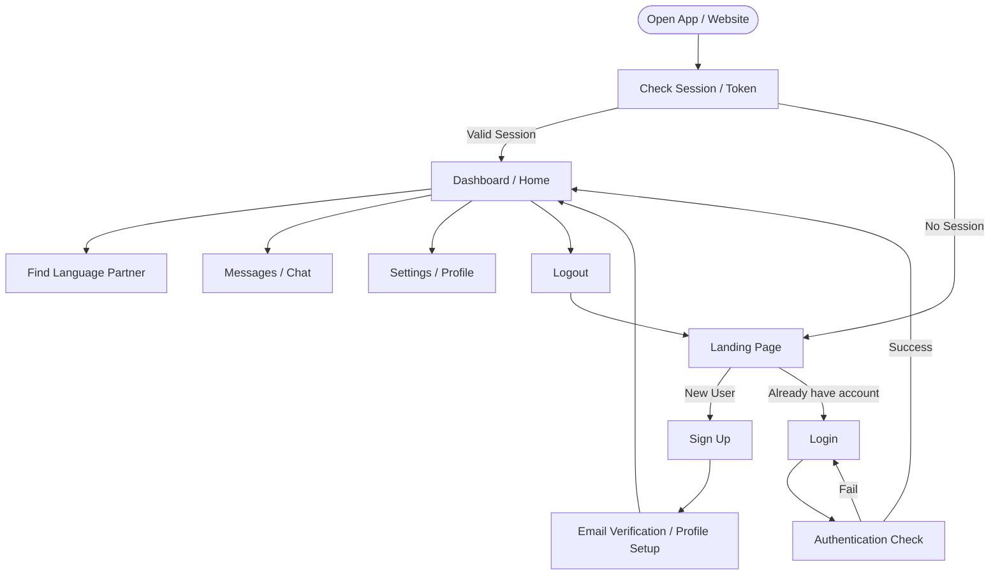

```mermaid
flowchart TD
    Start([Open App / Website]) --> Check[Check Session / Token]

    Check -->|Valid Session| F[Dashboard / Home]
    Check -->|No Session| A[Landing Page]

    A -->|New User| B[Sign Up]
    A -->|Already have account| C[Login]

    B --> D[Email Verification / Profile Setup]
    C --> E[Authentication Check]

    D --> F
    E -->|Success| F
    E -->|Fail| C

    F --> G[Find Language Partner]
    F --> H[Messages / Chat]
    F --> I[Settings / Profile]
    F --> J[Logout]

    J --> A


```
